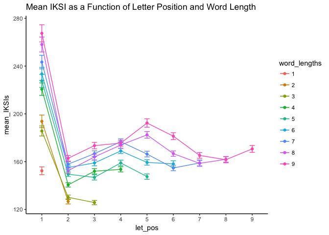
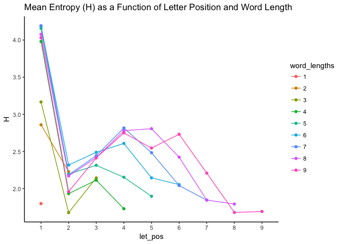
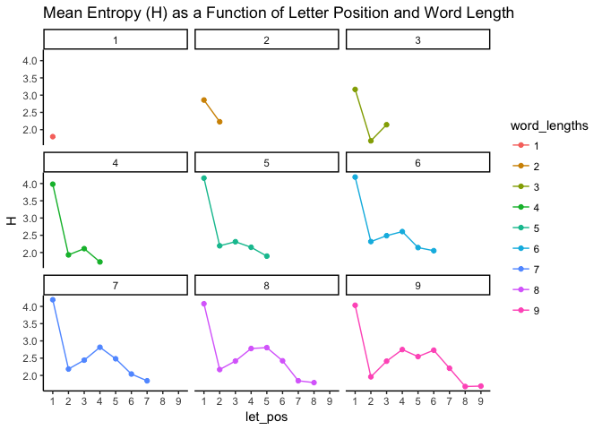
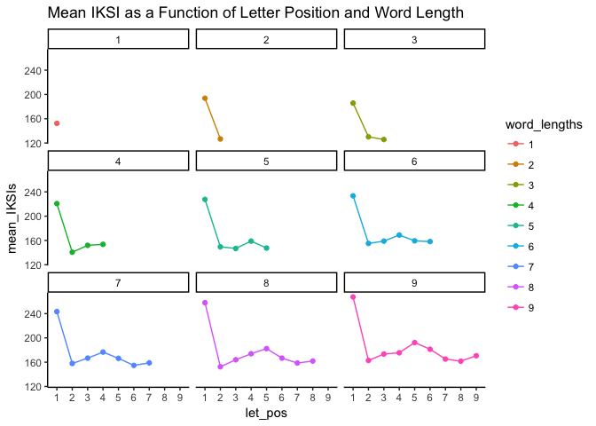
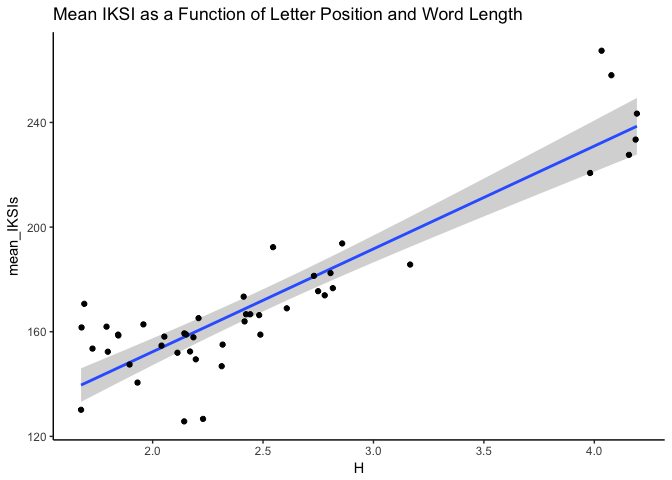

``` r
# mturk.txt is the unzipped mturk.txt.zip file
the_data <- fread("mturk.txt")

################
# Data-Exclusion

the_data[grepl("[[:punct:]]",substr(the_data$whole_word,nchar(the_data$whole_word),nchar(the_data$whole_word))),]$word_lengths=the_data[grepl("[[:punct:]]",substr(the_data$whole_word,nchar(the_data$whole_word),nchar(the_data$whole_word))),]$word_lengths-1
```

    ## Warning in `[<-.data.table`(`*tmp*`, grepl("[[:punct:]]", substr(the_data
    ## $whole_word, : Coerced 'double' RHS to 'integer' to match the column's
    ## type; may have truncated precision. Either change the target column
    ## ['word_lengths'] to 'double' first (by creating a new 'double' vector
    ## length 1933914 (nrows of entire table) and assign that; i.e. 'replace'
    ## column), or coerce RHS to 'integer' (e.g. 1L, NA_[real|integer]_, as.*,
    ## etc) to make your intent clear and for speed. Or, set the column type
    ## correctly up front when you create the table and stick to it, please.

``` r
the_data <- the_data %>%
             filter (
                      Letters != " ",                 #removes spaces (just in case they were assigned a letter position)
                      !grepl("[[:punct:]]",Letters),  #removes punctuation
                      !grepl("[0-9]",Letters),        #removes numbers
                      !grepl("[[A-Z]]*",Letters),   #removes Letters that have a capital letter
                      ParagraphType == "N",
                      PredBigramCorrect == "11",
                      IKSIs < 2000
             )


###############
# Analysis
# Get the means by word length and letter position for each subject
# Use Van Selst and Jolicouer non-recursive_moving procedure from Crump

subject_means <- the_data %>%
              group_by(Subject,word_lengths,let_pos) %>%
              summarize(mean_IKSI = mean(non_recursive_moving(IKSIs)$restricted))

# Get the grand means by averaging over subject means
sum_data <- subject_means %>%
              group_by(word_lengths,let_pos) %>%
              summarize(mean_IKSIs = mean(mean_IKSI, na.rm = TRUE),
                        SE = stde(mean_IKSI))

# plot the data

sum_data <- sum_data[sum_data$let_pos < 10, ]
sum_data <- sum_data[sum_data$word_lengths < 10 &
                     sum_data$word_lengths > 0, ]

sum_data$let_pos<-as.factor(sum_data$let_pos)
sum_data$word_lengths<-as.factor(sum_data$word_lengths)

limits <- aes(ymax = mean_IKSIs + SE, ymin = mean_IKSIs - SE)

ggplot(sum_data,aes(x=let_pos,y=mean_IKSIs,group=word_lengths,color=word_lengths))+
  geom_line()+
  geom_point()+
  geom_errorbar(limits,width=.2)+
  theme_classic()+
  ggtitle("Mean IKSI as a Function of Letter Position and Word Length")
```



NEW letter uncertainty
======================

``` r
## GET LETTER POSITION 1 H
# load in the excel file from Norvig:
letter_freqs <- fread("ngrams1.csv",integer64="numeric")
letter_freqs[letter_freqs==0]<-1

get_prob<- function(df) {apply(df,2,function(x){x/sum(x)})}
get_entropies <- function(df){apply(df,2,function(x){-1*sum(x*log2(x))})}

letter_probabilities<-get_prob(letter_freqs[,2:74])
letter_entropies<-get_entropies(letter_probabilities)


let_pos<-c(1,1:2,1:3,1:4,1:5,1:6,1:7,1:8,1:9)
word_lengths<-c(1,rep(2,2),
               rep(3,3),
               rep(4,4),
               rep(5,5),
               rep(6,6),
               rep(7,7),
               rep(8,8),
               rep(9,9))

uncertainty_df<-data.frame(H=letter_entropies[11:(11+44)],let_pos,word_lengths)
uncertainty_df_pos1<-uncertainty_df %>%
  filter(
    let_pos == 1
  )
#######
```

``` r
##### GET LETTER POSITION 2 - H
## read in n-gram tsv and clean up
gram_2 <- read.table('2-gram.txt',header=TRUE,sep="\t")
colnames(gram_2)<- scan(file="2-gram.txt",what="text",nlines=1,sep="\t")

  ## fix NA level
  levels(gram_2$`2-gram`)<-c(levels(gram_2$`2-gram`),as.character("NA"))
  gram_2[is.na(gram_2$`2-gram`),]$`2-gram` = as.character("NA")


  ## find and replace missing combos with 0 
  allLet<-c("A","B","C","D","E","F","G","H","I","J","K","L","M","N","O","P","Q","R","S","T","U","V","W","X","Y","Z")
  allCombos<-c()
    for (i in 1:length(allLet)){
      for(j in 1:length(allLet)){
        allCombos<-c(allCombos,paste(allLet[i],allLet[j],sep=""))
      }
    }
  
  missing<-allCombos[!allCombos%in%gram_2$`2-gram`]
  missing<-cbind(missing,matrix(0,nrow = length(missing), ncol = ncol(gram_2)-1))
  colnames(missing)<-colnames(gram_2)
  gram_2<-rbind(gram_2,missing)

  ## change 0s to 1s
  gram_2[gram_2 == 0] <- 1

  #split bigrams into letter 1 & 2
  letters <- data.frame(do.call('rbind', strsplit(as.character(gram_2$`2-gram`),'',fixed=TRUE)))
  colnames(letters)<-c('n-1','n')
  names(gram_2)[names(gram_2) == '2-gram'] <- 'bigram'
  gram_2<-cbind(letters,gram_2)
  
  #remove unnecessary columns
  gram_2<-gram_2[,-4:-12]
  gram_2<-gram_2[,-40:-56]
  gram_2[,4:39]<-apply(gram_2[,4:39],2,function(x){as.numeric(x)})

#############
  
  ## GET ENTROPIES
  get_prob<- function(df) {apply(df,2,function(x){x/sum(x)})}
  get_entropies <- function(df){apply(df,2,function(x){-1*sum(x*log2(x))})}
  
  letter_probabilities<-(with(gram_2,
       by(gram_2[,4:39],gram_2[,'n-1'], get_prob,simplify= TRUE)
  ))
  
  letter_entropies<-lapply(letter_probabilities,get_entropies)
  letter_entropies<-list.rbind(letter_entropies)

  #column means
  means<-colMeans(letter_entropies)
  
  #create data frame
 let_pos<-c(2:2,2:3,2:4,2:5,2:6,2:7,2:8,2:9)
word_lengths<-c(rep(2,1),
               rep(3,2),
               rep(4,3),
               rep(5,4),
               rep(6,5),
               rep(7,6),
               rep(8,7),
               rep(9,8))

uncertainty_df_pos2<-data.frame(H=means,let_pos,word_lengths)

#uncertainty_df_pos2<-uncertainty_df_pos2[uncertainty_df_pos2$let_pos == 2,]
```

``` r
uncertainty_df<-rbind(uncertainty_df_pos1,uncertainty_df_pos2)

uncertainty_df$let_pos<-as.factor(uncertainty_df$let_pos)
uncertainty_df$word_lengths<-as.factor(uncertainty_df$word_lengths)

######

## graphs


ggplot(uncertainty_df,aes(x=let_pos,y=H,group=word_lengths,color=word_lengths))+
  geom_line()+
  geom_point()+
  theme_classic()+
  ggtitle("Mean Entropy (H) as a Function of Letter Position and Word Length")
```



``` r
ggplot(uncertainty_df,aes(x=let_pos,y=H, color=word_lengths,group=word_lengths))+
  geom_line()+
  geom_point()+
  theme_classic()+
  ggtitle("Mean Entropy (H) as a Function of Letter Position and Word Length") + 
  facet_wrap(~word_lengths)
```



``` r
ggplot(sum_data,aes(x=let_pos,y=mean_IKSIs,color=word_lengths,group=word_lengths))+
  geom_line()+
  geom_point()+
  theme_classic()+
  ggtitle("Mean IKSI as a Function of Letter Position and Word Length")+
  facet_wrap(~word_lengths)
```



``` r
total_df<-merge.data.frame(uncertainty_df,sum_data)

ggplot(total_df,aes(x=H,y=mean_IKSIs))+
  geom_smooth(method = "lm") +
  geom_point()+
  theme_classic()+
  ggtitle("Mean IKSI as a Function of Letter Position and Word Length")
```



group level R squared
=====================

``` r
# Analysis
# Get the means by word length and letter position for each subject
subject_means <- the_data %>%
                filter (Letters != " ",
                      !grepl("[[:punct:]]",Letters),
                      !grepl("[0-9]",Letters),
                      !grepl("[[A-Z]]*",Letters)) %>%
              group_by(Subject,word_lengths,let_pos) %>%
              summarize(mean_IKSI = mean(IKSIs, na.rm = TRUE))

# Get the grand means by averaging over subject means
sum_data <- subject_means %>%
              group_by(word_lengths,let_pos) %>%
              summarize(mean_IKSIs = mean(mean_IKSI, na.rm = TRUE),
                        SE = stde(mean_IKSI))


sum_data <- sum_data[sum_data$let_pos < 10, ]
sum_data <- sum_data[sum_data$word_lengths < 10 &
                     sum_data$word_lengths > 0, ]

sum_data$let_pos<-as.factor(sum_data$let_pos)
sum_data$word_lengths<-as.factor(sum_data$word_lengths)

group_means<-merge(sum_data,uncertainty_df, by= c("let_pos","word_lengths"))

cor.test(group_means$mean_IKSIs,group_means$H)
```

    ## 
    ##  Pearson's product-moment correlation
    ## 
    ## data:  group_means$mean_IKSIs and group_means$H
    ## t = 13.206, df = 43, p-value < 2.2e-16
    ## alternative hypothesis: true correlation is not equal to 0
    ## 95 percent confidence interval:
    ##  0.8168979 0.9416343
    ## sample estimates:
    ##       cor 
    ## 0.8956632

subject level R squared
=======================

``` r
# Analysis
# Get the means by word length and letter position for each subject
subject_means <- the_data %>%
                filter (Letters != " ",
                      !grepl("[[:punct:]]",Letters),
                      !grepl("[0-9]",Letters),
                      !grepl("[[A-Z]]*",Letters)) %>%
  
                filter(let_pos < 10,
                       word_lengths < 10,
                       word_lengths > 0) %>%
              group_by(Subject,word_lengths,let_pos) %>%
              summarize(mean_IKSI = mean(IKSIs, na.rm = TRUE))


subject_means<-merge(subject_means,uncertainty_df, by= c("let_pos","word_lengths"))

summary<-subject_means %>%
  group_by(Subject) %>%
  summarize(
    p.value = cor.test(mean_IKSI,H)$p.value,
    correlation = cor.test(mean_IKSI,H)$estimate,
    r_squared = cor.test(mean_IKSI,H)$estimate^2
  ) %>%
  ungroup() %>%
  summarize(
    mean_p.value = mean(p.value),
    mean_correlation = mean(correlation),
    mean_rsquared = mean(r_squared)
  )
  
print(summary)
```

    ## # A tibble: 1 x 3
    ##   mean_p.value mean_correlation mean_rsquared
    ##          <dbl>            <dbl>         <dbl>
    ## 1       0.0309            0.658         0.482
