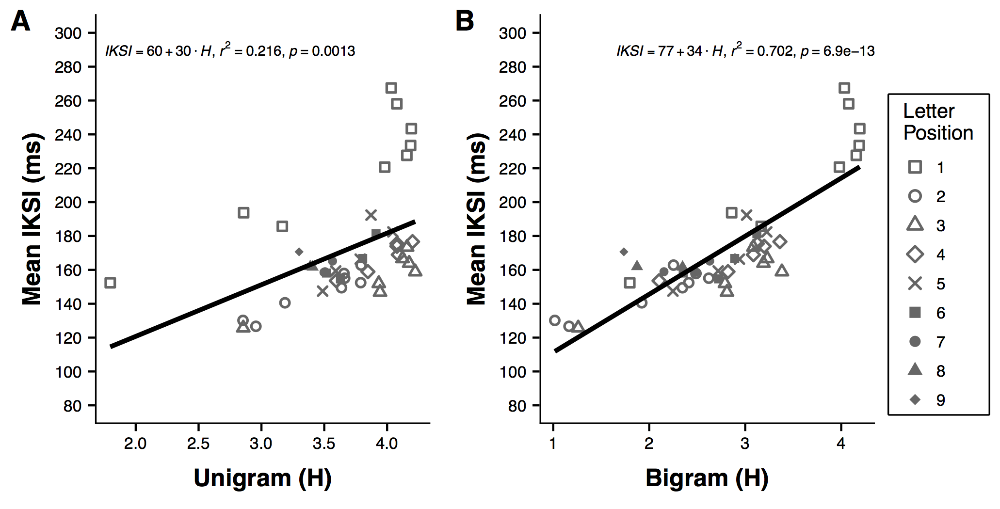

<style type="text/css">
.title {
  display: none;
}

#getting-started img {
  margin-right: 10px;
}

</style>

<div class="row" style="padding-top: 30px;">
<div class="col-sm-6">

#### Instance theory predicts information theory: Episodic uncertainty as a determinant of keystroke dynamics

Matthew J. C. Crump, Walter Lai, Nicholaus P. Brosowsky

Status: **Mansucript in Draft**, last compiled: `r Sys.Date()`

This is an open and reproducible project written in R Markdown, including .rmd files for analysis, and .rmd files to compile the paper in APA format using papaja (for .pdf), and this R Markdown website. In principle the source code and open data contained in the project repository should be sufficient for compiling and reproducing this paper.

This paper is has been submitted for publication at the Canadian Journal of Experimental Psychology, and is currently in the review process.

In addition to this website, pre-print versions of this paper have been submitted to psyarxiv.com [https://psyarxiv.com/keufc/](https://psyarxiv.com/keufc/), and the github repository has been archived with a DOI at the open-science frame work, [https://osf.io/bdnqr/](https://osf.io/bdnqr/), (DOI 10.17605/OSF.IO/BDNQR).

The current .pdf can be downloaded here []()

Below is the read.me for the Github repository.

- Github repository: [https://github.com/CrumpLab/EntropyTyping](https://github.com/CrumpLab/EntropyTyping)

  - `EntropyTyping.proj` is the R-studio project file
  - `mturk.txt.zip` is the raw data
  - files for compiling the paper include:
      
    - `v2-manuscript.Rmd` is the paper written using the papaja package
    - `v2-manuscript.pdf` is the .pdf version of this paper
    - `r-references.bib` and `EntropTypingRefs.bib` contain the bibliography files

  - the `data` folder contains various pre-processed data-files for the anlayses in the paper
  - the `figures` folder contains r scripts to generate the figures, and .pdfs of the figures that appear in the manuscript
  - the `analysis` and `simulation` folders contain r scripts for various analyses and simulations reported in the paper.
  - the `Original_submission` folder contains versioning of prior work for the original submission.
  - `index.Rmd`, `_site.yml`, `webpaper.css` contain files for compiling this website. The website files are saved in the `docs` folder, and served on the web using the github pages option for this repository.
      
- The [issues tab of the github repository](https://github.com/CrumpLab/EntropyTyping/issues) contains threaded discussions we had about this project


</div>
<div class="col-sm-6", style= "text-align:right;">

```{r, fig.height=2, fig.width=2, echo=FALSE}

```


</div>
