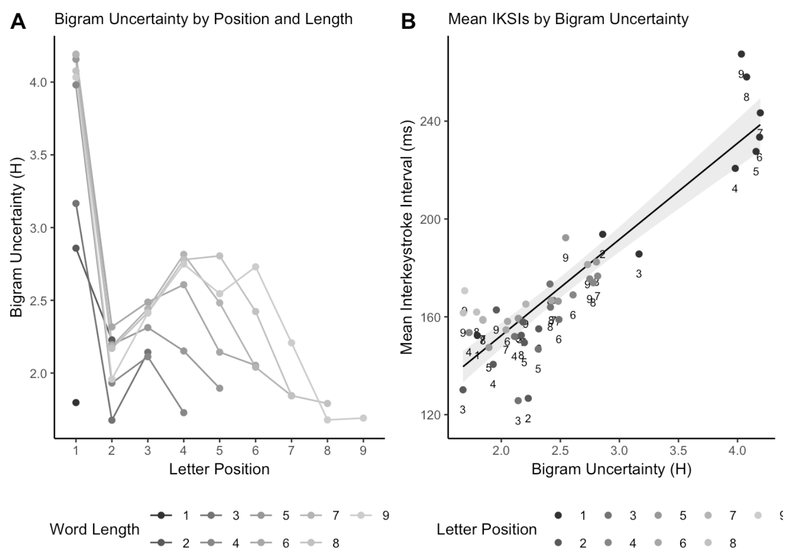

<style type="text/css">
.title {
  display: none;
}

#getting-started img {
  margin-right: 10px;
}

</style>

<div class="row" style="padding-top: 30px;">
<div class="col-sm-6">

#### Instance theory predicts information theory: Episodic uncertainty as a determinant of keystroke dynamics

Matthew J. C. Crump, Walter Lai, Nicholaus P. Brosowsky

Status: **Mansucript in Draft**, last compiled: `r Sys.Date()`

This is an open and reproducible project being written in public on Github. The entire project is written in R Markdown, including .rmd files for analysis, and .rmd files to compile the paper in APA format using papaja (for .pdf), and this R Markdown website. In principle the source code and open data contained in the project repository should be sufficient for compiling and reproducing this [paper](https://crumplab.github.io/EntropyTypingpaper/Entropy_typing_draft.html).

- Github repository: [https://github.com/CrumpLab/EntropyTyping](https://github.com/CrumpLab/EntropyTyping)
      - `EntropyTyping.proj` is the R-studio project file
      - `mturk.txt.zip` is the raw data
      - the `paper` folder conains
        - `Entropy_typing_draft.Rmd` is the paper written using the papaja package
        - `Entropy_typing_draft.pdf` is the .pdf version of this paper
        - `Entropy_typing_analysis.r` contains the analysis scripts for the paper. These scripts are linked to in the `Entropy_typing_draft.Rmd`
        - `r-references.bib` contains the bibliography file
        - `the_data.Rdata` contains the data used in the present analysis
      - the `_history` folder contains additional analysis files made by the authors throughout the course of the project
      - `index.Rmd`, `_site.yml`, `webpaper.css` contain files for compiling this website. The website files are saved in the `docs` folder, and served on the web using the github pages option for this repository.
      
- The [issues tab of the github repository](https://github.com/CrumpLab/EntropyTyping/issues) contains threaded discussions we had (are having) about this project


</div>
<div class="col-sm-6", style= "text-align:right;">

```{r, fig.height=2, fig.width=2, echo=FALSE}

```


</div>
